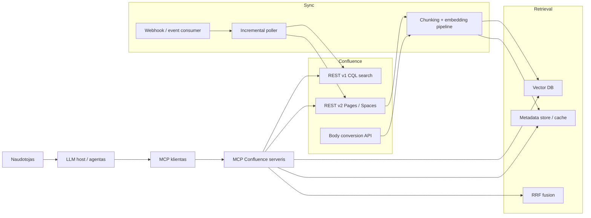
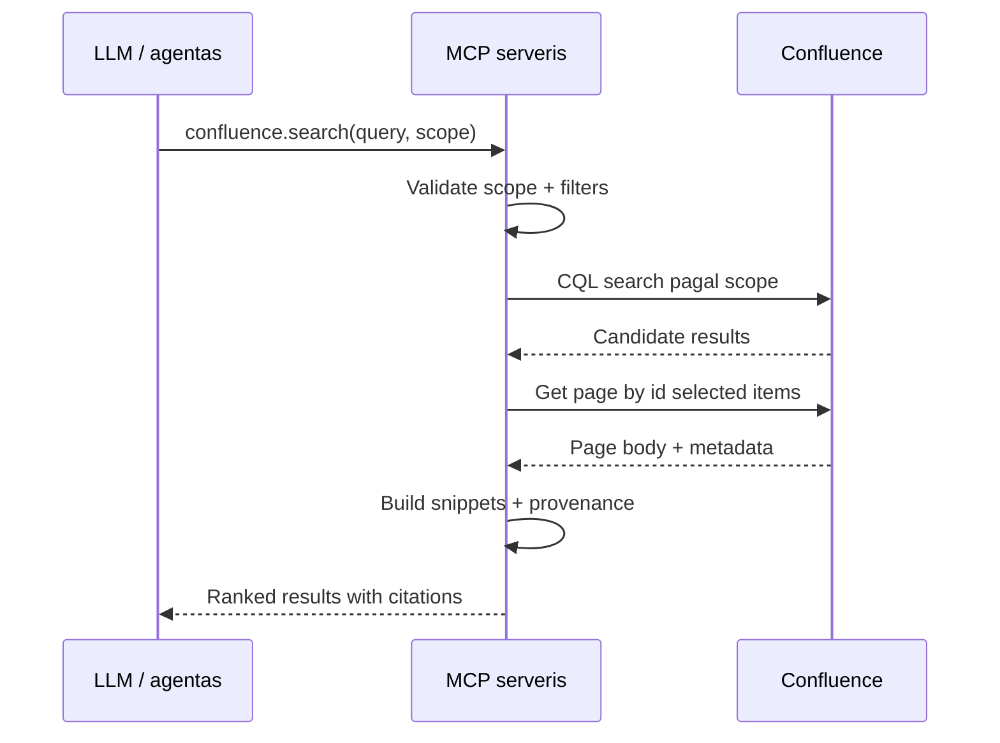
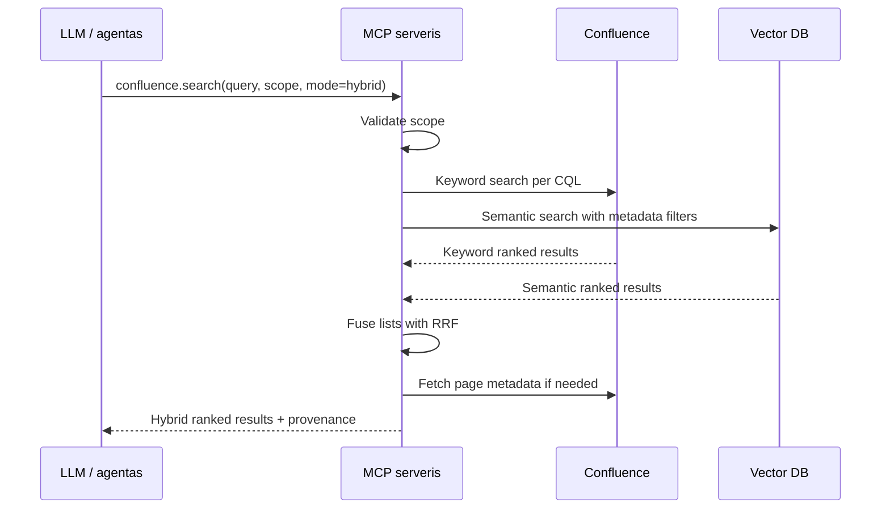

# Confluence MCP serverio įgyvendinimo planas

## Dabartine kryptis

Sis projektas yra vystomas kaip:

- API-key-only MCP serveris
- read-only MCP tool surface Confluence atzvilgiu
- vidinis sync/indexing mechanizmas be Confluence write operaciju

## Dokumento paskirtis

Šis dokumentas apibrėžia, kaip sukurti **MCP (Model Context Protocol) serverį**, skirtą saugiai, tiksliai ir valdomai Confluence turinio paieškai bei atsakymų generavimui. Planas remiasi hibridine architektūra, kurioje derinama:

- **Confluence CQL paieška** tiksliam, leidimais paremtam kandidatų atrinkimui
- **semantinė paieška per vektorinį indeksą** geresniam turinio atitikimui
- **RRF (Reciprocal Rank Fusion)** rezultatų sujungimui

Dokumentas skirtas naudoti kaip:

- techninis įgyvendinimo planas komandai
- MVP ir produkcinės versijos darbų planavimo pagrindas
- architektūrinis artefaktas saugumo, integracijų ir testavimo sprendimams

---

## 1. Tikslas

Sukurti MCP serverį, kuris leistų LLM ar agentui:

- ieškoti Confluence puslapiuose pagal natūralios kalbos užklausas
- griežtai riboti paieškos sritį pagal:
  - konkretų puslapį
  - puslapio medį
  - erdvę (`space`)
- užtikrinti, kad grąžinami rezultatai atitiktų realias Confluence teises
- grąžinti atsakymams tinkamą turinį su citatomis ir kilmės informacija
- turėti aiškų kelią nuo MVP iki produkcinio, enterprise lygio sprendimo

---

## 2. Sprendimo santrauka

Rekomenduojamas sprendimas yra **hibridinis MCP serveris**:

1. **Keyword-first retrieval**
   Naudoti Confluence CQL paiešką kaip pagrindinį leidimais apsaugotą rezultatų šaltinį.

2. **Semantic retrieval**
   Turėti atskirą chunkų ir embeddingų indeksą vektorinėje DB semantinei paieškai.

3. **Fusion layer**
   Sujungti CQL ir vector paieškos rezultatus per RRF.

4. **Strict scope enforcement**
   Scope ribojimą taikyti serverio pusėje, o ne palikti modeliui.

5. **Permission fidelity**
   Produkcijoje prioritetas turi būti vartotojo kontekstui per Atlassian OAuth 2.0 (3LO).

---

## 3. Ką turi spręsti sistema

### Funkciniai reikalavimai

- Paieška Confluence puslapiuose pagal laisvos formos užklausą
- Scope valdymas:
  - `page`
  - `page_tree`
  - `space`
- Galimybė gauti konkretų puslapį pagal `pageId`
- Galimybė indeksuoti puslapius semantinei paieškai
- Citatos, snippetai ir puslapio nuorodos kiekvienam rezultatui
- Hibridinis režimas: `keyword`, `semantic`, `hybrid`

### Nefunkciniai reikalavimai

- Saugus autentikacijos modelis
- Griežtas leidimų laikymasis
- Rate limit tolerancija
- Patikimas pagination valdymas
- Observability: logai, metrikos, tracing
- Aiški klaidų kategorizacija
- Galimybė plėsti į multi-tenant architektūrą

---

## 4. Tikslinė architektūra

## 4.1. Aukšto lygio vaizdas



## 4.2. Kodėl hibridinis modelis

### Tik tiesioginė API integracija

Privalumai:

- naujausi duomenys realiu laiku
- Confluence leidimai taikomi užklausos metu
- mažesnis architektūrinis sudėtingumas

Trūkumai:

- lėtesnė paieška
- silpnesnė semantinė atitiktis
- stipri priklausomybė nuo Confluence API ir rate limits

### Tik RAG / vector index

Privalumai:

- greita paieška
- geras semantinis matching
- tinkama dideliems žinių kiekiams

Trūkumai:

- sudėtingas leidimų modelis
- reikia atskiros sync infrastruktūros
- reikia spręsti duomenų šviežumo klausimą

### Hibridinis modelis

Privalumai:

- išlaikomas Confluence permission correctness
- gaunama geresnė semantinė paieška
- galima degraduoti iki keyword-only režimo

Trūkumai:

- daugiau komponentų
- sudėtingesnis veikimo ir stebėjimo modelis

### Sprendimas

MVP versijai startuoti nuo **CQL + fetch**.

Produkcinėje versijoje plėsti į:

- `keyword` paiešką per Confluence CQL
- `semantic` paiešką per vector DB
- `hybrid` paiešką su RRF

---

## 5. Technologiniai sprendimai

## 5.1. Kalba ir framework

Rekomenduojama:

- **TypeScript + Node.js**
- oficialus **MCP server SDK**
- `zod` arba JSON Schema validacija įrankių inputams
- `fetch` arba `axios` Confluence API klientui

Kodėl TypeScript:

- geras MCP ekosistemos palaikymas
- aiškesnė tool schema tipizacija
- paprastesnis serverio plėtimas į HTTP transportą

## 5.2. Transportas

### Lokalus naudojimas

- `stdio`

### Nutolęs naudojimas

- `Streamable HTTP`

Produkcijoje HTTP transportui būtina:

- autentikacija
- `Origin` validacija
- aiškus session / tenant kontekstas

## 5.3. Konfigūracija

Minimalūs aplinkos kintamieji:

```env
MCP_TRANSPORT=stdio
CONFLUENCE_BASE_URL=https://your-site.atlassian.net
CONFLUENCE_AUTH_MODE=api_token
CONFLUENCE_EMAIL=service-account@company.com
CONFLUENCE_API_TOKEN=***
DEFAULT_TOP_K=10
LOG_LEVEL=info
```

Plėtrai:

```env
ATLASSIAN_CLIENT_ID=***
ATLASSIAN_CLIENT_SECRET=***
ATLASSIAN_REDIRECT_URI=https://your-app/callback
VECTOR_DB_PROVIDER=pgvector
POSTGRES_URL=postgres://...
EMBEDDING_MODEL=text-embedding-3-large
```

---

## 6. MCP serverio įrankių dizainas

## 6.1. Minimalus tool rinkinys

MVP turi turėti bent šiuos tool'us:

| Tool pavadinimas           | Paskirtis                                  |
| -------------------------- | ------------------------------------------ |
| `confluence.search`        | Scoped paieška Confluence turinyje         |
| `confluence.get_page`      | Konkretaus puslapio gavimas pagal `pageId` |
| `confluence.get_page_tree` | Puslapio descendants / tree informacija    |

Papildomi tool'ai produkcijai:

| Tool pavadinimas           | Paskirtis                               |
| -------------------------- | --------------------------------------- |
| `confluence.get_citations` | Chunkų ar rezultatų citatų suformavimas |
| `confluence.sync_status`   | Indekso būsenos rodymas                 |
| `confluence.reindex_page`  | Vieno puslapio perindeksavimas          |

## 6.2. `confluence.search` įvesties kontraktas

Rekomenduojama schema:

```json
{
  "type": "object",
  "properties": {
    "query": { "type": "string", "minLength": 1 },
    "scope": {
      "type": "object",
      "properties": {
        "type": { "type": "string", "enum": ["page", "page_tree", "space"] },
        "pageId": { "type": "string" },
        "spaceKey": { "type": "string" }
      },
      "required": ["type"]
    },
    "filters": {
      "type": "object",
      "properties": {
        "contentType": { "type": "string", "enum": ["page"] },
        "updatedAfter": { "type": "string" },
        "labels": { "type": "array", "items": { "type": "string" } }
      }
    },
    "retrieval": {
      "type": "object",
      "properties": {
        "mode": { "type": "string", "enum": ["keyword", "semantic", "hybrid"] },
        "topK": { "type": "integer", "minimum": 1, "maximum": 50 }
      }
    }
  },
  "required": ["query", "scope"]
}
```

## 6.3. `confluence.search` išvesties kontraktas

```json
{
  "results": [
    {
      "rank": 1,
      "pageId": "12345",
      "title": "Project Plan",
      "spaceKey": "ENG",
      "url": "https://your-site/wiki/spaces/ENG/pages/12345",
      "snippet": "This section describes the release process...",
      "score": 0.91,
      "provenance": {
        "source": "hybrid",
        "retrievalDetails": {
          "keywordRank": 2,
          "semanticRank": 1
        }
      }
    }
  ],
  "nextCursor": null
}
```

## 6.4. MCP atsakymų formavimo principai

- Tool'ai turi grąžinti **struktūrizuotą JSON**, o ne laisvos formos tekstą
- Atsakymuose turi būti:
  - `pageId`
  - `title`
  - `url`
  - `snippet`
  - `spaceKey`
  - `provenance`
- Jei leidimų nėra, tool'as turi grąžinti aiškią, kategorizuotą klaidą

---

## 7. Confluence integracijos planas

## 7.1. Naudotini endpointai

### Paieška

- `GET /wiki/rest/api/search`
- Naudojama CQL paieškai
- Cursor pagination per `_links.next`

### Puslapiai

- `GET /wiki/api/v2/pages/{id}`
- Naudojama pilnam puslapio body ir metadata gavimui

### Erdvės

- `GET /wiki/api/v2/spaces`
- Naudojama space katalogui ir bootstrap sync procesui

### Ancestors / descendants

- v2 endpointai puslapio medžiui ir scope enforcement pagal `page_tree`

### Body conversion

- `contentbody/convert` API
- Naudojama turinio transformacijai į chunkingui tinkamą tekstinį pavidalą

## 7.2. Scope enforcement logika

### `page`

Serveris turi leisti tik konkretų `pageId`.

Naudojimas:

- CQL filtras pagal konkretų content ID
- vector DB filtre: `pageId == targetPageId`

### `page_tree`

Serveris turi grąžinti tik `rootPageId` descendants.

Naudojimas:

- CQL `ancestor = <rootPageId>`
- vector DB filtre: `ancestorIds CONTAINS rootPageId`

### `space`

Serveris turi grąžinti tik nurodytą erdvę.

Naudojimas:

- CQL `space = "SPACEKEY"`
- vector DB filtre: `spaceKey == "SPACEKEY"`

### Esminė taisyklė

Scope validacija turi būti vykdoma **serverio pusėje**, nepriklausomai nuo to, ką bando daryti LLM ar MCP klientas.

---

## 8. Autentikacija ir leidimai

## 8.1. Leidimų modelio principas

Confluence paieškos rezultatai turi būti grąžinami tik tuo atveju, jei vartotojas turi teisę juos matyti. Sprendimas turi būti projektuojamas taip, kad:

- scope ribojimas neleistų išeiti už leistinos srities
- Confluence leidimai nebūtų apeinami per indeksą
- service account modelis būtų naudojamas tik MVP ar ribotose vidinėse aplinkose

## 8.2. Galimi autentikacijos modeliai

### Variant as A: API token per service account

Tinka:

- MVP
- vidinei komandai
- kai indeksuojama tik leistina erdvė

Rizikos:

- galima per didelė prieiga
- silpnesnis permission fidelity

### Variant as B: OAuth 2.0 (3LO) per vartotoją

Tinka:

- produkcijai
- enterprise aplinkai
- atvejams, kai skirtingi vartotojai turi skirtingas teises

Privalumai:

- Confluence taiko realias vartotojo teises
- aukščiausias saugumo ir atitikties lygis

Trūkumai:

- sudėtingesnis token storage ir refresh valdymas
- reikia consent flow

## 8.3. Rekomendacija

### MVP

- naudoti API token su griežta space allowlist

### Produkcijai

- pereiti prie OAuth 2.0 (3LO)
- saugoti tokenus šifruotai
- pridėti audit logus ir tenant kontekstą

---

## 9. Paieškos vykdymo logika

## 9.1. MVP paieškos srautas



## 9.2. Produkcinės hibridinės paieškos srautas



## 9.3. Fusion principas

RRF formulė:

```text
score(d) = Σ 1 / (k + rank_i(d))
```

Kur:

- `d` yra dokumentas
- `rank_i(d)` yra dokumento vieta konkrečioje rezultatų aibėje
- `k` dažniausiai parenkamas apie `60`, bet turi būti testuojamas

---

## 10. Indeksavimo ir sync architektūra

## 10.1. Pagrindiniai sync režimai

### Full sync

Naudojamas:

- pradinei indeksacijai
- reindeksavimui po architektūrinių pokyčių

Žingsniai:

1. Gauti spaces sąrašą
2. Pereiti per puslapius
3. Gauti puslapio body
4. Normalizuoti turinį
5. Chunkinti
6. Sugeneruoti embeddingus
7. Upsertinti į vector DB ir metadata store

### Incremental sync

Naudojamas:

- reguliariam atnaujinimui
- remiantis `lastmodified`

Žingsniai:

1. Vykdyti CQL paiešką su `lastmodified > T`
2. Gauti pakeistus puslapius
3. Perindeksuoti tik pakeistus dokumentus

### Event-driven sync

Naudojamas:

- greitesniam atnaujinimui po content change

Pastaba:

- webhookai turi būti tik pagreitinimo mechanizmas
- polling turi likti kaip fallback

## 10.2. Chunking strategija

Rekomenduojama:

- chunkinti pagal antraštes
- laikyti `sectionPath`
- išlaikyti 600-1200 tokenų chunk dydį
- lenteles transformuoti į struktūrizuotą tekstą

Minimalus chunk metadata modelis:

```json
{
  "chunkId": "page-12345-chunk-7",
  "pageId": "12345",
  "spaceKey": "ENG",
  "title": "Release Process",
  "sectionPath": ["Release Process", "Deployment", "Rollback"],
  "ancestorIds": ["100", "110", "12345"],
  "lastModified": "2026-04-08T10:15:00Z"
}
```

## 10.3. Turinio normalizavimas

Reikia numatyti transformaciją iš:

- `atlas_doc_format`
- `storage`
- prireikus `view`

Tikslas:

- gauti stabilų, tekstinį reprezentavimą chunkingui ir snippet generavimui

## 10.4. Attachments strategija

MVP etape:

- attachments neindeksuoti, nebent tai būtina

Produkcinėje versijoje:

- įjungti tik su aiškiu allowlist
- taikyti governance taisykles
- logiškai atskirti attachment extraction pipeline

---

## 11. Vektorinės saugyklos pasirinkimas

## 11.1. `pgvector`

Tinka, jei:

- komanda jau turi PostgreSQL
- norima paprastesnės infrastruktūros
- reikalingas stiprus metadata ir relational modelis

Rekomendacija:

- naudoti HNSW indeksą
- pradėti su konservatyviais parametrais

## 11.2. `Qdrant`

Tinka, jei:

- norima atskiros vector-first sistemos
- svarbūs metadata filtrai
- norima švaresnio retrieval sluoksnio

## 11.3. `OpenSearch`

Tinka, jei:

- organizacija jau naudoja OpenSearch
- norima vienoje vietoje turėti BM25 ir vector search

## 11.4. Rekomendacija

### Jei reikia greitai paleisti

- `pgvector`

### Jei norima aiškaus retrieval komponento

- `Qdrant`

---

## 12. Citatos ir provenance modelis

Kiekvienas rezultatas turi turėti šiuos laukus:

| Laukas            | Paskirtis                                     |
| ----------------- | --------------------------------------------- |
| `pageId`          | Stabilus Confluence puslapio identifikatorius |
| `pageTitle`       | Žmogiškai suprantamas pavadinimas             |
| `spaceKey`        | Space identifikatorius                        |
| `pageUrl`         | Kanoninė nuoroda į puslapį                    |
| `snippet`         | Tikslus ištraukos tekstas                     |
| `sectionPath`     | Antraščių hierarchija                         |
| `lastModified`    | Auditui ir šviežumui                          |
| `retrievedAt`     | Kada rezultatas buvo paimtas                  |
| `retrievalSource` | `keyword`, `semantic`, arba `hybrid`          |

### Svarbi taisyklė

UI ar agentas neturi generuoti atsakymų be nuorodų į bent vieną aiškų provenance objektą.

---

## 13. Saugumo reikalavimai

## 13.1. MCP transporto saugumas

Jei naudojamas HTTP transportas, būtina:

- autentikacija kiekvienam prašymui
- `Origin` validacija
- apsauga nuo DNS rebinding tipo grėsmių
- session ir tenant konteksto validacija

## 13.2. Confluence prieigos kontrolė

- nepasitikėti vien modelio elgsena
- scope ribas tikrinti serverio pusėje
- naudoti least privilege principą
- service account atveju riboti allowed spaces

## 13.3. Slaptų duomenų apsauga

- tokenus laikyti secret manager'yje
- šifruoti juos at rest
- nebandyti loginti raw access tokenų
- nenaudoti raw page body loguose, jei to nereikia

## 13.4. Organizacinės politikos

Reikia projektuoti klaidų modelį, kuris aiškiai atskirtų:

- `401 unauthorized`
- `403 forbidden`
- `policy_block`
- `rate_limit`
- `upstream_error`

---

## 14. Pagination, retry ir resilience

## 14.1. Pagination

### Search v1

- naudoti `_links.next`
- tvarkingai saugoti ir perduoti cursor

### API v2

- sekti `Link` header su `rel="next"`
- arba `_links.next`, jei endpointas grąžina

## 14.2. Retry strategija

Ant šių atvejų:

- `429`
- laikini `5xx`
- transient network failures

Naudoti:

- exponential backoff
- jitter
- maksimalų retry skaičių

## 14.3. Degradavimo režimai

Jei vector DB neveikia:

- grįžti į `keyword-only`

Jei Confluence paieška laikinai stringa:

- grąžinti aiškią klaidą, o ne dalinai neteisingus rezultatus

---

## 15. Observability ir eksploatacija

## 15.1. Metrikos

Minimalus rinkinys:

- `tool_latency_ms{tool}`
- `confluence_requests_total{endpoint,status}`
- `confluence_rate_limit_hits_total`
- `confluence_retry_total`
- `vector_query_latency_ms`
- `keyword_query_latency_ms`
- `index_sync_lag_seconds`
- `pages_indexed_total`
- `chunks_indexed_total`
- `permission_denials_total`

## 15.2. Struktūruoti logai

Kiekviename request'e:

- `request_id`
- `trace_id`
- `tool_name`
- `auth_mode`
- `scope_type`
- `space_key`
- `root_page_id`
- `query_hash`
- `result_count`
- `error_class`

## 15.3. Tracing

Rekomenduojama iš karto projektuoti tracing grandinę:

- MCP request
- Confluence API call
- vector DB query
- fusion
- response build

---

## 16. Testavimo planas

## 16.1. Contract testai

Tikslas:

- validuoti MCP tool input schemas
- validuoti grąžinamus response shape
- validuoti klaidų formatą

## 16.2. Integraciniai testai

Tikslas:

- patikrinti paiešką prieš realią ar testinę Confluence aplinką
- patikrinti pagination
- patikrinti retries

## 16.3. Scope enforcement testai

Privalomi scenarijai:

1. `page` negrąžina kitų puslapių
2. `page_tree` negrąžina sibling ar kitų medžių rezultatų
3. `space` negrąžina rezultatų iš kitos erdvės

## 16.4. Permission regression testai

Reikia bent du vartotojai:

- vartotojas su ribota prieiga
- vartotojas su platesne prieiga

Tikslas:

- patikrinti, kad ribotas vartotojas negautų nei snippet, nei title, nei URL draudžiamam turiniui

## 16.5. Retrieval quality vertinimas

Paruošti 50-200 realių klausimų rinkinį ir vertinti:

- Recall@K
- MRR
- citation correctness
- keyword vs semantic vs hybrid palyginimą

---

## 17. Darbų planas ir etapai

## 17.1. Etapas A: Projekto pagrindas

### Tikslas

Paruošti kodinę bazę ir bazinį MCP serverio skeletą.

### Darbai

- sukurti projektą `TypeScript`
- pridėti MCP SDK
- sukurti konfigūracijos sluoksnį
- sukurti Confluence API klientą
- įsidiegti logging ir error handling pagrindą

### Deliverables

- veikiantis `stdio` MCP serveris
- `.env.example`
- bazinė projekto struktūra

## 17.2. Etapas B: MVP scoped search

### Tikslas

Paleisti pirmą naudotiną paieškos versiją.

### Darbai

- implementuoti `confluence.search`
- implementuoti `confluence.get_page`
- implementuoti `confluence.get_page_tree`
- pridėti scope validaciją
- pridėti CQL query builder
- pridėti snippet ir citation generatorių

### Deliverables

- scoped paieška per Confluence CQL
- citations su URL ir snippet
- baziniai integraciniai testai

## 17.3. Etapas C: Saugumas ir HTTP deploy

### Tikslas

Paruošti serverį produkcijai tinkamam eksponavimui.

### Darbai

- įdiegti `Streamable HTTP`
- pridėti autentikaciją
- pridėti `Origin` validaciją
- įdiegti rate limit handling
- pridėti audit logų struktūrą

### Deliverables

- HTTP MCP endpointas
- security middleware
- retry / resilience mechanizmai

## 17.4. Etapas D: Indeksavimas ir semantinė paieška

### Tikslas

Pridėti semantinę paiešką ir hibridinį retrieval.

### Darbai

- sukurti full sync worker
- sukurti incremental sync worker
- sukurti chunking pipeline
- generuoti embeddingus
- prijungti vector DB
- įdiegti RRF fusion

### Deliverables

- veikianti vector paieška
- `mode=semantic`
- `mode=hybrid`

## 17.5. Etapas E: Produkcinis hardening

### Tikslas

Užbaigti enterprise lygio eksploatacijai.

### Darbai

- OAuth 3LO
- webhook / event support
- retrieval evaluation harness
- monitoring dashboardai
- incident runbook'ai
- governance ir retention taisyklės

### Deliverables

- produkcinei aplinkai paruoštas sprendimas
- observability ir SLO
- dokumentuotos operacinės procedūros

---

## 18. Laiko sąmata

Jei dirba 2 inžinieriai:

| Etapas             | Trukmė   |
| ------------------ | -------- |
| Projekto pagrindas | 3-5 d.   |
| MVP scoped search  | 1-2 sav. |
| Security + HTTP    | 1-2 sav. |
| Semantic + sync    | 2-4 sav. |
| Hardening          | 3-6 sav. |

### Realistiška projekto trukmė

- **MVP:** 3-5 savaitės
- **produkcinė versija:** dar 6-10 savaičių po MVP

---

## 19. MVP apimtis

MVP turi turėti:

- `confluence.search`
- `confluence.get_page`
- scope enforcement pagal `page`, `page_tree`, `space`
- citations su `title`, `url`, `snippet`
- CQL paiešką
- pagination valdymą
- retry ant `429`
- bazinius testus

MVP neturi būti blokuojamas dėl:

- vector DB
- attachment parsing
- webhookų
- multi-tenant architektūros

---

## 20. Produkcinės versijos apimtis

Produkcinėje versijoje turi atsirasti:

- OAuth 2.0 (3LO)
- vector DB ir semantic search
- hybrid paieška su RRF
- incremental sync
- webhookai arba event-driven invalidation
- observability dashboardai
- governance ir audit trail
- aiškus incidentų valdymas

---

## 21. Rizikos ir jų mažinimas

| Rizika                                  | Poveikis                    | Mažinimo būdas                               |
| --------------------------------------- | --------------------------- | -------------------------------------------- |
| Service account turi per plačią prieigą | Galimas duomenų nutekėjimas | Riboti spaces, kuo greičiau pereiti prie 3LO |
| Rate limits                             | Lėta ar nestabili paieška   | Backoff, caching, batchinimas                |
| Indeksas pasensta                       | Netikslūs atsakymai         | Incremental sync + polling fallback          |
| Scope bug                               | Nutekina neteisingą turinį  | Griežti scope testai ir security review      |
| Vector DB outage                        | Hybrid paieška neveikia     | Fallback į keyword-only                      |
| Webhookai nepatikimi                    | Praleisti update'ai         | Polling saugiklis                            |

---

## 22. Projekto struktūros rekomendacija

```text
src/
  server/
    index.ts
    transport/
      stdio.ts
      http.ts
  tools/
    confluence-search.ts
    confluence-get-page.ts
    confluence-get-page-tree.ts
  confluence/
    client.ts
    cql.ts
    pagination.ts
    auth.ts
  retrieval/
    fusion.ts
    snippets.ts
    citations.ts
  indexing/
    sync-full.ts
    sync-incremental.ts
    chunking.ts
    embeddings.ts
    vector-store.ts
  security/
    origin-validation.ts
    permissions.ts
  observability/
    logger.ts
    metrics.ts
    tracing.ts
  types/
    tool-schemas.ts
tests/
docs/
```

---

## 23. Priėmimo kriterijai

Sprendimas laikomas priimtu, kai:

1. MCP klientas gali atrasti ir iškviesti `confluence.search`
2. Scope enforcement neleidžia išeiti už nurodytos ribos
3. Paieškos rezultatai turi citatas ir URL
4. `429` atvejai apdorojami korektiškai
5. Testai padengia bent kritinius saugumo scenarijus
6. Loguose matomas request identifikavimas ir klaidų klasės

Produkcinė versija laikoma priimta, kai papildomai:

1. veikia OAuth 3LO
2. veikia hybrid paieška
3. veikia incremental sync
4. yra stebėjimo dashboardai ir incidentų procedūros

---

## 24. Rekomenduojamas įgyvendinimo prioritetas

### Pirma

- CQL paieška
- tool schemas
- scope enforcement
- citations

### Antra

- HTTP transportas
- auth
- retries
- monitoring

### Trečia

- sync pipeline
- chunking
- embeddings
- vector DB
- RRF

### Ketvirta

- 3LO
- webhooks
- governance
- evaluacija

---

## 25. Išvada

Optimalus kelias šiam projektui yra:

- pradėti nuo **saugaus, permission-correct MVP**, kuris remiasi Confluence CQL paieška
- scope ribojimą visada vykdyti **serverio pusėje**
- citatas laikyti pirmos klasės rezultato dalimi
- po MVP pridėti **semantinį indeksą** ir **hybrid retrieval**
- produkcijai pereiti prie **user-delegated OAuth 2.0 (3LO)** ir pilno observability sluoksnio

Toks planas leidžia greitai pristatyti vertę, bet kartu neįsivaryti į architektūrą, kuri vėliau trukdytų saugumui, skalei ar leidimų tikslumui.

---

## 26. Siūlomi artimiausi žingsniai

1. Patvirtinti, ar pirmas taikinys yra **Confluence Cloud**, o ne Data Center
2. Nuspręsti MVP autentikacijos modelį:
   - API token
   - ar iš karto 3LO
3. Pasirinkti transportą:
   - tik `stdio`
   - ar iš karto ir `Streamable HTTP`
4. Nuspręsti, ar MVP apima tik `keyword search`, ar iš karto planuojamas indeksavimo sluoksnis
5. Sukurti starter projektą pagal šiame dokumente aprašytą struktūrą
